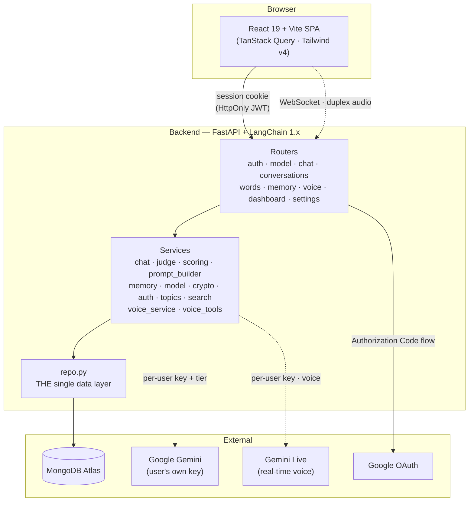
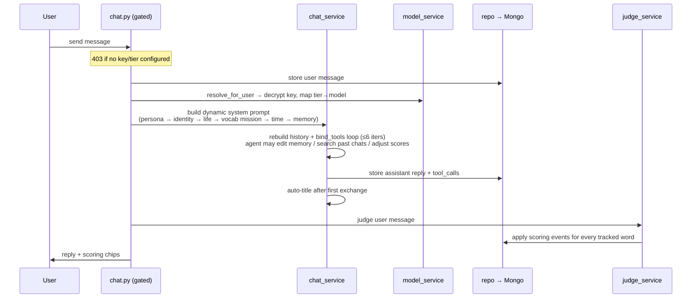

<div align="center">

# 🗣️ Fluently

### The English companion that *teaches without teaching.*

**Fluently is a persona-driven chat companion that helps intermediate English speakers master real vocabulary — not through flashcards or quizzes, but by weaving the words you want to learn into natural conversation with an AI that genuinely knows you.**

<br/>

`React 19` · `FastAPI` · `LangChain 1.x` · `MongoDB Atlas` · `Google Gemini` · `Google OAuth`

</div>

---

## The problem

Most people stall at the same place in a second language: **intermediate**. They can hold a conversation, but their vocabulary plateaus. The words they *want* to own — the precise, expressive, native-sounding ones — never make the jump from "I recognize it" to "I use it without thinking."

The tools that promise to fix this mostly don't. Flashcard apps drill words out of context, so learners can recall a definition but freeze when they need the word in a real sentence. Quiz apps are a chore, so people quit. And generic AI chatbots will happily *converse*, but they have no memory of who you are, no idea which words you're struggling with, and no plan to actually make you better.

The thing that works — the thing that's always worked — is **talking to someone who knows you, cares that you improve, and quietly steers the conversation toward the words you need to practice.** Fluently is that someone, as software.

---

## What Fluently does

You give the AI an identity at onboarding — a name, a relationship to you (best friend, mentor, mentor-crush, sibling), a personality, a way of speaking. You add the words and phrases you want to master. Then you just... **chat.**

Underneath that ordinary-feeling conversation, a hidden engine runs on every turn:

- 🎯 **It picks your weakest words** to practice, using spaced repetition (lowest score first, then least recently used).
- 🕸️ **It weaves them into the conversation naturally** — following a deliberate 5-step strategy it is instructed *never to reveal*: set words up more than it uses them, react when you use one well or badly, model cleaner English, and never break character as your friend.
- ⚖️ **It silently scores how well you produced each word** — a separate lightweight "judge" model reads your message after every turn and classifies your usage of *all* your tracked words, applying a proficiency score change. This never blocks or slows the chat.
- 🧠 **It remembers your life.** Fluently maintains a living memory of who you are, what's happening in your life, and the relationship you share — and edits that memory itself, with real tools, as it learns new things about you.
- ⏰ **It knows what time it is.** Every conversation is grounded in the real date, weekday, and part of day, so it can reference *yesterday*, *this week*, or *the deadline you mentioned* correctly.
- 🎙️ **You can just talk to it.** Tap the mic and have a real, out-loud conversation — full-duplex voice, in the persona's own voice, with your word usage scored live as you speak.

To the user, it feels like texting (or talking to) a friend who happens to be a brilliant, patient English tutor. That gap — between how simple it feels and how much is happening underneath — **is the product.**

---

## Why it's interesting (the parts we're proud of)

Fluently is not "a chatbot with a system prompt." A handful of design decisions make it genuinely different — and each one is real, in the code, today:

### 🎭 Invisible pedagogy
The teaching is engineered to be *undetectable*. The dynamic system prompt (assembled fresh on every call in a deliberate attention-ordering) makes vocabulary practice the persona's **#1 hidden mission** and memory curation its **#2 job** — but the model is explicitly forbidden from ever surfacing the machinery. The learner never sees a "lesson." They see a friend who's oddly good at picking topics.

### 🧠 Self-editing living memory
Most "memory" in AI apps is a vector dump. Fluently's is **three human-readable free-text files** — *identity* (timeless facts about you), *memory* (your life in motion, with absolute dates the AI writes itself), and *persona* (what the AI remembers about your shared relationship) — that the agent **reads and edits with its own tools** mid-conversation. Append a new fact, edit a changed one, delete an obsolete one. No line IDs, no machine timestamps, no schema — just prose the model curates like a diary. You can read and edit all three yourself in the app.

### ⚖️ A scoring model that mirrors real learning
A transparent scoring matrix (the single source of truth in one service) rewards the behavior that actually signals mastery:

| Event | Score change |
|---|---|
| Used perfectly, **unprompted** | **+5** |
| Used perfectly, but **prompted** | **+3** |
| Used but **awkward** | **+1** |
| Used **wrong** | **−2** |
| **Passively** understood | **+0.5** |
| **Idle decay** (after 14 days) | **−1 / week** |

Scores are 0–100, no daily cap (a word *can* go 0→100 in one day of real progress), with lazy decay applied on read. Every score change is traceable to the message that caused it, and shown in the UI as a chip you can expand to read the judge's reasoning.

### 🎙️ Real-time voice — talk to your persona out loud
Beyond text, you can **speak** to your companion in a live, full-duplex voice call powered by **Google Gemini Live**. The browser streams your mic to the backend, which proxies it to Gemini and streams the persona's spoken reply back — barge-in and all. It's not a bolt-on: voice reuses the *entire* text brain — the same persona, memory, full vocabulary list, and tools — so the companion you talk to is the same one you text.

Two things make it special:
- **The same USP, live.** Because a live model calls tools reliably, voice scores your words **inline** via a dedicated `score_word` tool the moment you say one — a score animation pops on screen mid-sentence, no waiting. It routes through the *same* scoring service as text, so your numbers never diverge across modes.
- **Each persona has a voice.** Every companion is assigned one of ~30 Gemini Live voices (a hand-picked fit for the curated "Discover" figures, or your own choice in the persona editor). And if the persona is someone the model already knows — Newton, Austen, a fictional character — it's prompted to *embody their manner of speaking*, not just recite a description.

Voice conversations are transcribed and **saved into the same chat thread** as text, so nothing is lost when you hang up — reopen the mic and it picks up with full history.

### 🔑 Bring-your-own-key, with a choice of brains
Every user supplies **their own Google Gemini API key** and picks a tier that governs *every* LLM call they make:

- **Swift** (`gemini-3.1-flash-lite`) — quick, natural, light on quota.
- **Sage** (`gemini-3.5-flash`) — sharper, more thoughtful, uses quota faster.

The key is **encrypted at rest** (Fernet symmetric encryption; the master key lives only in the server's environment, never in the database — a database leak yields useless ciphertext). No shared server-side key, no per-user cost to the operator, and the tier catalogue is a single source of truth: adding a third brain is a one-row config change.

### 🏗️ A single swappable data layer
Every byte of database access goes through **one module** (`repo.py`). Services and routers never touch the driver directly. Swapping MongoDB for something else later means rewriting one file — the rest of the app doesn't know or care where data lives.

### 🔐 Real multi-user, zero passwords
Google OAuth only ("Continue with Google"). Server-side Authorization Code flow — **Google's tokens never reach the browser**, and we store none of them. Sessions are stateless signed JWTs in an HttpOnly cookie; the CSRF handshake is guarded by a short-lived signed state+nonce cookie. Every stored document is scoped to a real user id, and the data isolation between users is enforced and tested.

---

## Architecture at a glance



### What happens in a single chat turn



---

## Tech stack

| Layer | Technology |
|---|---|
| **Frontend** | React 19, Vite 6, Tailwind CSS v4 (CSS-first `@theme`), TanStack Query, motion, lucide-react, sonner, react-markdown. No router (state-based views). |
| **Backend** | FastAPI, LangChain 1.x (manual `bind_tools` loop — not `create_agent`; we own persistence), Pydantic v2, Uvicorn. |
| **Database** | MongoDB Atlas via PyMongo (sync), behind a single swappable data layer. |
| **LLM** | Google Gemini (`google_genai` provider), bring-your-own-key, Swift/Sage tiers. |
| **Voice** | Google Gemini Live (real-time duplex audio) via the `google-genai` SDK, proxied over a WebSocket; browser AudioWorklet for 16kHz PCM capture + 24kHz playback. |
| **Auth** | Google OAuth 2.0 (server-side code flow) + stateless JWT session cookie (PyJWT HS256). |
| **Crypto** | Fernet symmetric encryption for users' API keys at rest (`cryptography`). |
| **Search** | BM25 + regex over past messages (`rank-bm25`), ranked in Python. |

---

## Project structure

```
ENG/
├── frontend/                React 19 + Vite SPA
│   └── src/
│       ├── App.jsx          Gating: health → auth → onboarding → model-config → app
│       ├── api.js           fetch wrapper (credentials:'include'), one fn per endpoint
│       ├── hooks/           TanStack Query hooks + useVoiceSession (mic/WS/playback)
│       └── components/      Chat · VoiceOverlay · Words · Memory · Settings · Personas · Onboarding · Login · Shared
│
├── backend/
│   ├── app/
│   │   ├── main.py          FastAPI app, CORS, routers, startup (Mongo ping + indexes)
│   │   ├── config.py        Settings + MODEL_TIERS (Swift/Sage) + VOICES catalogue
│   │   ├── repo.py          THE single data layer — only module touching Mongo
│   │   ├── deps.py          Auth deps: get_current_user, require_model_configured
│   │   ├── prompts.py       ALL prompt templates
│   │   ├── routers/         HTTP layer: auth · model · chat · conversations · words · voice (WS) …
│   │   └── services/        Business logic: chat · judge · scoring · memory · model · voice_service · voice_tools …
│   ├── tests/               Permanent pytest suite (LLMs mocked by default)
│   ├── run_tests.py         Area-selectable concise test runner
│   └── requirements.txt
│
├── docs/
│   ├── deployment-guide.md  Production deploy (Vercel + Render + custom domain)
│   └── oauth-handoff.md     OAuth design decisions
│
└── CLAUDE.md                Internal source-of-truth for project structure (for contributors)
```

---

## Getting started (local development)

Fluently runs as two services: a **FastAPI backend** on `:8000` and a **React frontend** on `:5173`. You'll set both up locally below.

### Prerequisites

Before you start, make sure you have:

- **Python 3.10+** and **Node.js 18+** (with npm)
- A **MongoDB Atlas** cluster (the free tier is fine) — [create one here](https://www.mongodb.com/cloud/atlas/register)
- A **Google Cloud OAuth 2.0 Web client** (for "Continue with Google" login)
- A **Google Gemini API key** — *each user brings their own at onboarding*, so you'll want at least one to try the app ([get one from Google AI Studio](https://aistudio.google.com/apikey))

---

### 1. Clone the repository

```bash
git clone <your-repo-url>
cd ENG
```

---

### 2. Backend setup

```bash
cd backend

# Create and activate a virtual environment
python -m venv .venv
.venv\Scripts\activate            # Windows (PowerShell/cmd)
# source .venv/bin/activate       # macOS / Linux

# Install dependencies
pip install -r requirements.txt
```

#### Configure environment variables

Copy the example env file and fill it in:

```bash
copy .env.example .env             # Windows
# cp .env.example .env             # macOS / Linux
```

You need to fill in **four** groups of values in `backend/.env`:

**a) Encryption key** — encrypts users' Gemini keys at rest. Generate one:

```bash
python -c "from cryptography.fernet import Fernet; print(Fernet.generate_key().decode())"
```

```env
ENCRYPTION_KEY=<paste the generated key>
```

> ⚠️ **Never rotate this key once real data exists** — stored API keys become undecryptable. It's the one secret you keep forever.

**b) MongoDB** — your Atlas connection string, *including* the database name in the path:

```env
MONGODB_URI=mongodb+srv://<user>:<password>@<cluster>.mongodb.net/fluently?retryWrites=true&w=majority
MONGODB_DB=fluently
```

**c) Google OAuth** — from your Google Cloud Console OAuth 2.0 Web client. Add this **exact** redirect URI in the console: `http://localhost:8000/api/auth/google/callback`

```env
GOOGLE_OAUTH_CLIENT_ID=<your client id>
GOOGLE_OAUTH_CLIENT_SECRET=<your client secret>
OAUTH_REDIRECT_BASE=http://localhost:8000
FRONTEND_URL=http://localhost:5173
CORS_ALLOWED_ORIGINS=http://localhost:5173,http://localhost:3000
```

**d) Session secrets** — strong random values for signing cookies. Generate each:

```bash
python -c "import secrets; print(secrets.token_urlsafe(48))"
```

```env
SESSION_SECRET=<paste a generated secret>
STATE_COOKIE_SECRET=<paste another generated secret>
SESSION_MAX_AGE_DAYS=7
```

> The `OPENAI/ANTHROPIC/GOOGLE_API_KEY` and `DEFAULT/JUDGE/UTILITY_*` model settings in `.env.example` are **legacy and unused** — real users bring their own Gemini key at onboarding. Leave them blank.

#### Run the backend

```bash
uvicorn app.main:app --reload --port 8000
```

The server pings Atlas on startup (and fails fast if it can't reach it), then ensures indexes. Visit [http://localhost:8000/api/health](http://localhost:8000/api/health) to confirm it's up.

---

### 3. Frontend setup

In a **new terminal**:

```bash
cd frontend
npm install
```

Tell the frontend where the backend lives — create `frontend/.env`:

```env
VITE_API_URL=http://localhost:8000
```

> `VITE_API_URL` is baked in at **build time** — if you change it later, restart the dev server / rebuild.

Run the dev server:

```bash
npm run dev
```

Open [http://localhost:5173](http://localhost:5173).

---

### 4. First run — onboarding

1. **Continue with Google** to sign in (the account is auto-created on first login).
2. **Set up your persona** — name your companion, pick its relationship to you, describe its personality.
3. **Tell it about yourself** — a name and a free-text "about you" (this gets intelligently distilled into your memory files).
4. **Choose a brain** — paste your Gemini API key, verify it, and pick **Swift** or **Sage**.
5. You'll land on the **Words** tab — add a few words you want to master, then start a **Chat** and watch them appear naturally in conversation. Prefer talking? Tap the 🎙️ **mic** in the composer to have the whole conversation out loud instead. (Want to pick your persona's voice? Open **Settings → Personas → Manage**, edit a persona, and choose from the voice list.)

---

## Testing

The backend ships with a permanent pytest suite. LLM calls are mocked by default (fast and free), and tests run against an **isolated** `<db>_test` database — your real data is never touched.

```bash
cd backend

.venv\Scripts\python run_tests.py                 # ALL areas (LLMs mocked, ~5s)
.venv\Scripts\python run_tests.py words scoring    # only the named area(s)
.venv\Scripts\python run_tests.py --list           # show available area keys
.venv\Scripts\python run_tests.py --live           # + real-Gemini smoke tests (costs quota)
```

> Running the suite requires network access and a valid `MONGODB_URI` — even the mocked run hits the real Atlas cluster's `_test` database.

---

## Deployment

Fluently deploys cleanly as two services (frontend + backend on separate domains) with **nothing environment-specific hardcoded** — every URL, origin, and secret comes from environment variables. Cookies automatically flip to `SameSite=None; Secure` when the frontend and backend are on different domains, so the session survives a split deploy.

📘 **Full production guide** (Vercel + Render + Google Console + custom domain, secret-free, with a hard-won debugging playbook): **[`docs/deployment-guide.md`](docs/deployment-guide.md)**

---

## API surface (overview)

All endpoints except the auth handshake require the session cookie (`401` without it) and are scoped to the logged-in user. LLM-using routes return `403` until the user has configured a key + tier.

| Group | Endpoints |
|---|---|
| **Auth** | `GET /api/auth/google/login`, `GET /api/auth/google/callback`, `GET /api/auth/me`, `POST /api/auth/logout` |
| **Model (BYO key)** | `GET /api/model/tiers`, `GET /api/model/status`, `POST /api/model/key`, `PUT /api/model/tier` |
| **Chat** | `POST /api/chat/{conversation_id}` |
| **Conversations** | `POST /api/conversations`, `GET` list/detail/messages, `PATCH .../category`, `POST .../opener`, `DELETE`, `POST /api/conversations/search` |
| **Words** | `GET/POST/GET/DELETE /api/words…`, `POST .../adjust`, `GET .../events`, `PUT .../note` |
| **Memory** | `GET/POST/PUT` identity · memory · persona files, `PUT .../persona/form`, `POST /api/memory/onboarding` |
| **Personas** | `GET/POST/PUT/DELETE /api/personas…`, `POST .../activate`, `GET /catalog`, `POST /catalog/{id}/use` |
| **Voice** | `WS /api/voice/ws/{conversation_id}` (real-time audio), `GET /api/voice/voices`, `GET /api/voice/status` |
| **Dashboard** | `GET /api/dashboard/stats` |
| **Settings** | Data-management hard-delete endpoints |

---

## For contributors

This repo uses a **hierarchical context system** to stay navigable: [`CLAUDE.md`](CLAUDE.md) is the top-level source of truth for project structure, and every code folder has its own `*Context.md` blueprint describing its scope, files, and local editing rules. If you change code that's documented there, update the corresponding context file in the same change — a stale context file is treated as a high-severity bug.

Key conventions:
- **All database access** goes through `app/repo.py` — services and routers never touch PyMongo directly.
- **All scoring rules** live only in `app/services/scoring_service.py`.
- **Every LLM call** is scoped to the calling user's own encrypted key + tier via `model_service.resolve_for_user` — never the app's own key.
- **Every new API/feature** gets tests in the same change (happy path + error paths + side effects).

---

<div align="center">

*Fluently — because the best way to learn a language is to talk to someone who knows you.*

</div>
